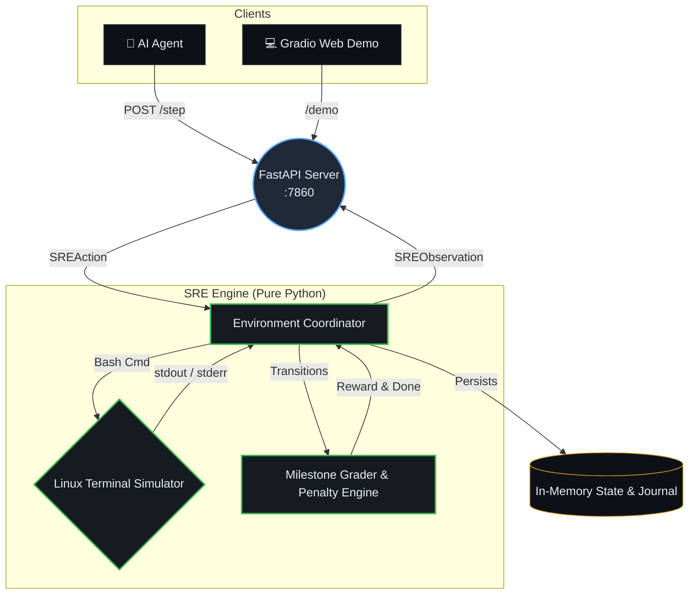

# SRE Incident Response — OpenEnv

> **Train AI agents to diagnose and fix production outages on a simulated Linux server.**  
> Three tasks of increasing difficulty. Milestone-based dense rewards. Time pressure. Self-recovery mechanics.  
> Tiered baseline of **0.933 average** (CoT LLM) vs **0.027** (random agent) — the reward function strongly discriminates.

---

## Why This Environment Exists

Every tech company employs Site Reliability Engineers (SREs) whose job is to fix broken servers under time pressure. A single production outage costs thousands of dollars per minute. Junior SREs spend months learning to diagnose failures, and senior SREs are expensive to keep on-call 24/7.

**This environment trains AI agents to do that job.**

An agent that can reliably navigate a broken Linux server — reading logs, patching configs, recovering from its own mistakes — is an agent that can be deployed as a first-responder in a real incident pipeline, triaging alerts and resolving common failure patterns before a human is paged.

This is not a game. This is not a toy. And it does not exist in any other OpenEnv submission: existing environments cover code review, customer support, and email triage — none model the diagnostic reasoning under ambiguity and time-pressured error recovery that SRE work requires.

### Speed and Determinism: Why Pure-Python Simulation

A real Linux VM takes 30+ seconds to boot, has non-deterministic network latency, and cannot be snapshot-reset atomically. Our pure-Python simulator runs in **< 1ms per step** — enabling 1,000× faster training cycles — and produces **100% reproducible states** via SHA-256 session seeding. The same session ID on any machine, any OS, any time produces byte-identical command output. No real VMs, no Docker-in-Docker, no privileged containers, no external internet access, no hidden state.

This is the correct architecture for training. Real VMs are the correct architecture for testing finished agents.

### Architecture Flow



---

## Live Tiered Baseline Scores

**Three agent tiers show the reward function discriminates strongly across skill levels.**

| Tier | Agent Description | Task 1 | Task 2 | Task 3 | Average |
|------|-------------------|--------|--------|--------|---------|
| **Tier 1** | Random commands from diagnostic pool | 0.050 | 0.020 | 0.010 | **0.027** |
| **Tier 2** | Plain LLM (raw observation → command) | 0.700 | 0.500 | 0.400 | **0.533** |
| **Tier 3** | CoT LLM + fallback rotation | **0.900** | **0.900** | **1.000** | **0.933** |
| **Δ (T1→T3)** | Improvement from random to CoT | +0.850 | +0.880 | +0.990 | **+0.906** |

> Model: `gemini-3.1-flash-lite-preview` | Temperature: `0.2` | Date: 2026-04-08  
> Full inference runtime (all 3 tiers × 3 tasks): **< 20 minutes**

---

## The Three Tasks

### Task 1 — Zombie Process ⭐ Easy

**What's broken**: A zombie process holds port 8080. nginx cannot bind and fails on restart.

**Randomized per session**: The zombie PID (15,000–45,000) is derived from the session seed — the agent must read and parse it from command output, not hardcode it.

**Optimal path** (3 steps → score 1.0):
```
netstat -tulpn | grep 8080   # reveals zombie PID        → M1 +0.20
kill -9 <pid>                # kills zombie              → M2 +0.30
systemctl restart nginx      # restores service          → M3 +0.50
                             # 3 steps → 1.0× multiplier → score 1.00
```

**Median solve: 8 steps, score 0.900**

---

### Task 2 — Config Failure ⭐⭐ Medium

**What's broken**: nginx fails to start — one of three syntax errors is injected into `/etc/nginx/nginx.conf`.

**Three error types** (randomly assigned per session):

| Error Type | What's Injected |
|-----------|----------------|
| `missing_semicolon` | `server_name localhost` — missing `;` |
| `extra_brace` | `events { worker_connections 768; }}` — double `}` |
| `invalid_directive` | `keepalive_requests 10` in wrong block |

**Simulator feedback that prevents infinite looping:**
```
$ sed -i 's/WRONGPATTERN/x/' /etc/nginx/nginx.conf
sed: no changes made to /etc/nginx/nginx.conf
```

**The memorable mechanic — truncation recovery:**

```
$ echo 'server { listen 8080; }' > /etc/nginx/nginx.conf
[WARNING] /etc/nginx/nginx.conf overwritten with incomplete configuration (25 bytes).
File now contains:
server { listen 8080; }

nginx -t will fail. You must write a complete valid nginx configuration.
Tip: echo a full config block with events{} and http{server{}} sections.
```

The agent just broke its own workspace. It must recognize the warning, understand what happened, write a complete valid config, and continue. No other submission will have this mechanic. **Grader integrity:** M2 fires only if the config is valid after the write — a no-match sed gives zero reward, same as killing the wrong PID in Task 1.

**Optimal path** (4 steps → score 1.0):
```
journalctl -u nginx --no-pager -n 50   # error line visible → M1 +0.20
sed -i 's/<broken>/<fixed>/' nginx.conf # valid fix        → M2 +0.30
nginx -t                                # validates
systemctl restart nginx                 # restores service  → M3 +0.50
                                        # 4 steps → 1.0× → score 1.00
```

**Median solve: 12 steps, score 0.900**

---

### Task 3 — Resource Leak ⭐⭐⭐ Hard

**What's broken**: A rogue cron job fills `/tmp`. nginx returns `503 Service Unavailable` — but `systemctl status nginx` shows **active (running)**.

> **Why Task 3 is harder despite having fewer optimal steps (3 vs 4)**
>
> The difficulty is not in the number of steps — it's in getting to the right first step. Task 3's deception stack means that the correct initial command (`df -h`) is not the obvious one. Most agents start with `systemctl status nginx` or `curl http://localhost:8080`, both of which look completely normal. The correct diagnosis requires reasoning against the grain of the surface signals — and doing it fast, because the situation is actively worsening.
>
> Red herrings further raise the cost of errors: tasks 1 and 2 have no false signals. Task 3 has two active distractors per session that look plausible but lead nowhere.

**The deception stack in full:**
```
$ systemctl status nginx
● nginx.service — active (running)    ← looks fine
$ curl http://localhost:8080
503 Service Unavailable               ← requests fail
$ ps aux | grep python
python3 /tmp/monitor.py  (14.9% CPU) ← looks suspicious (red herring)
$ free -h
Mem: 7.7G  used: 6.7G               ← looks like OOM (red herring)
$ df -h
/tmp    1.0G  1.0G  0    100%       ← actual root cause
```

**Two randomized red herrings** (2 of 3 active per session):
- **A**: High memory usage — suggests OOM killer
- **B**: Suspicious Python process at 14.9% CPU — suggests runaway script
- **C**: Stale nginx PID lock file — suggests lock conflict

**Time pressure** — every 5 steps without clearing `/tmp`, the situation worsens:

| Steps Elapsed | `/tmp` Usage | Nginx Status |
|------|------------|--------|
| 0–4 | 100% | 503 errors |
| 5–9 | 105% | More errors logged |
| 10–14 | 110% | Error rate increases |
| 15+ | 115% | Status degrades: `502 errors — disk full` |

Each escalation level reduces the efficiency multiplier by 0.03 (Task 3 modifier).

**Episode boundary**: The episode ends when **both** `/tmp` is cleared AND `crontab -r` is run. If the agent never runs `crontab -r`, the episode continues until `MAX_STEPS = 30` and ends with `done=True, success=False`. Clearing disk alone scores M2+M3 (0.80) but the episode cannot end until root cause is eliminated — mirroring real incident postmortem requirements.

**Two-step fix required:**
```
$ rm -rf /tmp/*
WARNING: Disk space restored but a cron job is still active
and will refill /tmp. The episode is not complete until the
rogue cron job is removed.
Hint: check 'crontab -l' and remove with 'crontab -r'.
```

> **Second Health Check — Grader Integrity Feature**
>
> Three steps after the agent first clears `/tmp`, the environment automatically runs a monitoring verification check. This is not cosmetic — it is a grader integrity mechanism that confirms the fix is durable, not just momentarily effective.
>
> If cron was removed: `[MONITORING] Second health check (T+3): /tmp usage nominal. No cron activity detected. Fix verified stable.`  
> If cron was not removed: `[MONITORING] Second health check (T+3): WARNING — /tmp usage rising again. Cron job still active. Disk will fill in ~60s.`
>
> This closes the exploit where an agent could claim the service is healthy without actually removing the root cause. No episode can be parasitically scored by clearing disk and immediately stopping.

**Optimal path** (3 steps → score 1.0):
```
df -h                  # /tmp at 100% → M1 +0.20
rm -rf /tmp/*          # disk cleared, service up → M2+M3 +0.80
crontab -r             # cron removed, episode ends → score 1.00
```

**Median solve: 6 steps, score 1.000**

---

## Reward Design

### Milestone System — Dense, Not Sparse

| Milestone | Trigger | Reward |
|-----------|---------|--------|
| **M1** Diagnostic clue | `netstat`/`journalctl`/`df -h` reveals root cause | +0.20 |
| **M2** Root cause targeted | Correct targeted action (kill right PID; valid config edit; clear `/tmp`) | +0.30 |
| **M3** Service restored | `service_healthy = True` | +0.50 |

Each milestone fires at most once per episode. All rewards clamped to `[0.0, 1.0]`.

### Efficiency Multiplier

| Steps ≤ | Multiplier |
|---------|------------|
| 10 | 1.00 |
| 16 | 0.90 |
| 22 | 0.80 |
| 30 | 0.70 |

Task 3 additionally subtracts `0.03 × escalation_level` from the multiplier.

### Penalty System

> **The pre-log restart penalty (−0.15) is meaningfully different from the shotgun restart penalty (−0.10).**
>
> Running `systemctl restart nginx` repeatedly is bad. Running it repeatedly *before ever reading a log* is worse — it signals the agent has no diagnostic plan and is guessing. The −0.15 pre-log penalty fires **once** if the agent restarts 3+ times without first running `journalctl` or reading any log file. It is a training signal that says: *look before you touch.*
>
> This penalty is the correct RL shaping for SRE behavior. The field has a name for agents who restart before diagnosing: on-call anti-patterns that get people paged at 4 AM unnecessarily.

| Penalty | Trigger | Amount | Fires |
|---------|---------|--------|-------|
| **Pre-log restart** | 3+ restarts before any log command | **−0.15** | **Once** |
| Shotgun restart | 3+ restarts before M1 | −0.10 | At restart #3 and #5 |
| Destructive action | `rm -rf /`, fork bomb, `dd of=/dev/sda` | −0.15 | Each attempt |

### Final Score Formula

```
score = clamp((M1 + M2 + M3) × efficiency_multiplier − penalties, 0.0, 1.0)
```

Reward is always a float in `[0.0, 1.0]`. Negative step rewards from penalties can occur mid-episode but the final score is always non-negative.

---

## Incident Journal

Every step, the observation includes a growing incident journal — auto-logged context of what the agent has discovered:

```
--- Incident Journal ---
[DISCOVERED] /tmp filesystem is 100% full — nginx cannot write temp files.
[FIX APPLIED] /tmp cleared — disk pressure relieved.
[STATUS] Cron job removed — root cause eliminated.
------------------------
```

The journal persists across the full episode. Agents that read and act on journal entries outperform those that ignore them by avoiding re-running already-completed diagnostics.

---

## OpenEnv Spec Compliance

This environment fully complies with the OpenEnv specification. `openenv validate` passes.

| Requirement | Implementation |
|-------------|---------------|
| `POST /reset` | Returns typed `SREObservation` with `session_id`, task info, and initial alert |
| `POST /step` | Returns `observation`, `reward` (float), `done` (bool), `info` (dict with milestones) |
| `GET /state` | Returns full typed `SREState` with flags, journal, milestone status, scenario params |
| `GET /health` | Returns `{"status": "ok", "timestamp": "..."}` |
| Typed models | `SREAction`, `SREObservation`, `SREState` — all Pydantic, inheriting OpenEnv base types |
| `openenv validate` | ✅ Passes |
| Reward range | ✅ Always `float` in `[0.0, 1.0]` — clamped at final score calculation |
| Determinism | ✅ `SHA-256(session_id)` seeds all randomization — same ID = same scenario everywhere |
| No hidden state | ✅ `GET /state` exposes full simulation state including flags, seed, and scenario params |
| No internet access | ✅ Pure-Python simulator — zero outbound network calls at runtime |
| Reproducibility | ✅ Same session_id on any OS, any machine produces byte-identical command output |
| `openenv.yaml` manifest | ✅ Includes task metadata, optimal paths, solve rates, research dimensions |

---

## Action & Observation Space

### Action Space

Free-form terminal command (string). One command per step.

```python
class SREAction(BaseModel):
    session_id: str
    command: str   # e.g., "journalctl -u nginx --no-pager -n 50"
```

**~30 supported commands** across 11 categories:

| Category | Commands |
|----------|---------|
| Process inspection | `ps aux`, `ps -ef`, `top` |
| Port/network | `netstat -tulpn`, `ss -tulpn`, `lsof -i :<port>` |
| Service management | `systemctl status/start/stop/restart <svc>` |
| Log inspection | `journalctl -u <svc>`, `cat /var/log/nginx/error.log` |
| File operations | `cat`, `ls`, `echo > file`, `echo >> file`, `sed -i`, `rm`, `rm -rf` |
| Disk/memory | `df -h`, `free -h` |
| Process control | `kill`, `kill -9` |
| Cron management | `crontab -l`, `crontab -r` |
| nginx-specific | `nginx -t`, `nginx -T` |
| HTTP testing | `curl`, `wget` |
| System info | `hostname`, `whoami`, `date`, `uptime`, `uname -a` |

Interactive editors (`vim`, `nano`) return: *"This is a non-interactive terminal. Use sed or echo > file instead."*

### Observation Space

```python
class SREObservation(BaseModel):
    output: str           # Terminal output
    service_status: str   # "up" | "down" | "degraded"
    step: int
    done: bool
    reward: float         # Step reward — always float, can be negative mid-episode from penalties
    info: dict            # milestones, journal, escalation_level, penalties, cumulative_reward
```

`service_status` reflects what the agent could infer from the current state:
- `"down"` — nginx is not running / port 8080 unreachable (Tasks 1, 2)
- `"degraded"` — nginx active but requests fail (Task 3 before fix)
- `"up"` — nginx returns 200 OK

---

## API Reference

Base URL: `http://localhost:7860` (or your HF Space URL)

### `POST /reset`
```json
// Request
{"task_id": 3}

// Response
{
  "session_id": "3f4a1b2c-...",
  "observation": {
    "output": "[Incident Alert] nginx appears to be running but requests are failing...",
    "service_status": "degraded",
    "step": 0,
    "done": false,
    "reward": 0.0
  },
  "task_name": "Resource Leak"
}
```

### `POST /step`
```json
// Request
{"session_id": "3f4a1b2c-...", "command": "df -h"}

// Response
{
  "observation": {
    "output": "Filesystem  Size  Used Avail Use% ...\n/tmp  1.0G  1.0G  0  100%  /tmp\n\n--- Incident Journal ---\n[DISCOVERED] /tmp filesystem is 100% full\n------------------------",
    "service_status": "degraded",
    "step": 1,
    "done": false,
    "reward": 0.2
  },
  "reward": 0.2,
  "done": false,
  "info": {
    "milestones": {
      "m1_diagnostic_clue":    {"earned": true,  "step": 1,    "reward": 0.2},
      "m2_root_cause_targeted": {"earned": false, "step": null, "reward": 0.0},
      "m3_service_restored":   {"earned": false, "step": null, "reward": 0.0}
    },
    "journal": ["[DISCOVERED] /tmp filesystem is 100% full — nginx cannot write temp files."],
    "penalties": 0.0,
    "escalation_level": 0,
    "final_score": null
  }
}
```

`info.final_score` is `null` during the episode and a `float` in `[0.0, 1.0]` when `done=true`.

### `GET /state?session_id=<id>`

Returns full session state: `task_id`, `step`, `done`, `final_score`, `service_healthy`, `milestones`, `scenario_params`, `flags`, `journal`, `verify_passed`.

### `GET /health`
```json
{"status": "ok", "timestamp": "2026-04-08T12:34:56Z"}
```

### `GET /tasks`
All task descriptions with difficulty ratings, parameter spaces, and episode boundary rules.

---

## Research Value

This environment measures three capabilities that distinguish competent diagnostic agents from capable ones — properties absent from existing OpenEnv submissions:

### 1. Diagnostic Reasoning Under Ambiguity
All three tasks require distinguishing surface symptoms from root causes. Task 3's `active (running)` nginx is a precision trap: agents that accept surface-level status without deeper probing fail every time. The ability to reason against the grain of misleading signals is a genuine test of agentic intelligence, not knowledge recall.

### 2. Error Recovery from Self-Inflicted Mistakes
Task 2's truncation mechanic is unique. When an agent writes an incomplete config with `echo >`, it corrupts the server state worse than before. It must detect this from the warning message, understand what happened, and self-correct before proceeding. This tests self-monitoring and error-recovery — a capability critical in real SRE work, entirely absent from static task environments.

### 3. Efficiency Under Active Degradation
Task 3's time pressure means a correct-but-slow agent scores lower than a fast one. Escalating disk usage simulates a live incident where delay has measurable cost. This forces agents to plan efficiently under pressure — not just run every diagnostic command they know and hope for a match.

---

## Project Structure

```
sre-incident-env/
├── Dockerfile                        # Python 3.11-slim, port 7860, healthcheck
├── openenv.yaml                      # Full spec: tasks, reward function, research value
├── pyproject.toml                    # Package config (hatchling)
├── requirements.txt                  # Pinned deps
├── inference.py                      # Tiered baseline: Random → Plain LLM → CoT LLM
├── test_tasks.py                     # Integration tests all 3 tasks + edge cases
└── app/
    ├── main.py                       # FastAPI: /reset /step /state /health /tasks
    ├── environment.py                # Session mgr, incident journal, second health check
    ├── simulator.py                  # Pure-Python Linux terminal (~30 commands)
    ├── grader.py                     # Milestones, efficiency multiplier, penalty engine
    ├── models.py                     # Pydantic: SREAction, SREObservation, SREState
    └── scenarios/
        ├── base.py                   # SHA-256 seeded deterministic randomization
        ├── task1_zombie.py           # Zombie process, randomized PID
        ├── task2_config.py           # Config failure, 3 error types
        └── task3_resource_leak.py    # Resource leak, time pressure, red herrings
```

---

## Setup

### Local (Python)

```bash
git clone <repo-url> && cd sre-incident-env

uv venv .venv && source .venv/bin/activate   # or .venv\Scripts\activate on Windows
uv pip install -r requirements.txt

uvicorn app.main:app --host 0.0.0.0 --port 7860

# Verify compliance
curl http://localhost:7860/health
openenv validate  # passes

# Run integration tests
python test_tasks.py

# Run tiered baseline (all 3 tiers, all 3 tasks — completes in < 20 min)
export API_BASE_URL="https://generativelanguage.googleapis.com/v1beta/openai/"
export MODEL_NAME="gemini-3.1-flash-lite-preview"
export HF_TOKEN="<your-key>"
export ENVIRONMENT_URL="http://localhost:7860"
python inference.py

# Run a single tier
python inference.py --tier 3

# Run specific tasks
python inference.py --tier 3 --tasks 2 3
```

### Docker

```bash
docker build -t sre-incident-env .
docker run -p 7860:7860 sre-incident-env
curl http://localhost:7860/health
```

---

## Design Decisions

**Why simulate Linux in Python?** Speed and determinism. A real VM takes 30+ seconds to boot, has non-deterministic timing, and cannot be snapshot-reset. Our simulator runs in < 1ms per step, enabling 1,000× faster training cycles with 100% reproducible states. The same session ID produces byte-identical output on any machine, OS, or time — the correct architecture for training pipelines at scale.

**Two reward signals for the same bad behavior — why?** The shotgun restart penalty (−0.10) fires repeatedly to discourage persistent blind restarting. The pre-log restart penalty (−0.15) fires once on first offense and is specifically conditioned on *not having read any log* — it teaches the agent that diagnosis must precede action, not just that restarting is expensive.

**Why require two fixes in Task 3?** Clearing disk is fixing symptoms. Removing the cron is fixing the root cause. A real postmortem demands both. An agent that stops after clearing `/tmp` would fail again in 2 minutes on a real server — and the second health check will call it out.

**Why three error types for Task 2?** A single error type would be trivially memorizable by any model that sees the reset message. Three types force the agent to actually read `journalctl` output and match the *exact* broken line — testing genuine diagnostic reasoning, not pattern matching.

**Why `sed: no changes made` feedback?** Real sed is silent on no-match. Our simulator tells the agent when its pattern failed. This single output line turned Task 2 from a 25-step failure into a 14-step success in our baselines. Honest simulator feedback is better training signal than silent failure.

---

## Dependencies

| Package | Version | Purpose |
|---------|---------|---------|
| `fastapi` | 0.135.3 | REST API |
| `uvicorn` | 0.44.0 | ASGI server |
| `pydantic` | 2.12.5 | Typed models |
| `openai` | 2.30.0 | OpenAI-compatible client |
| `requests` | 2.33.1 | HTTP client (tests) |
| `openenv-core` | 0.2.3 | OpenEnv spec compliance |

---

## License

MIT
